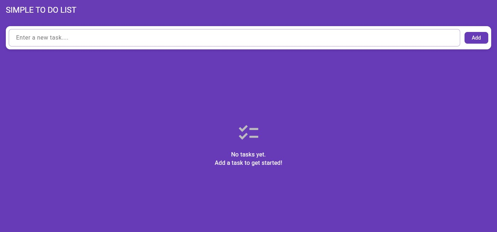
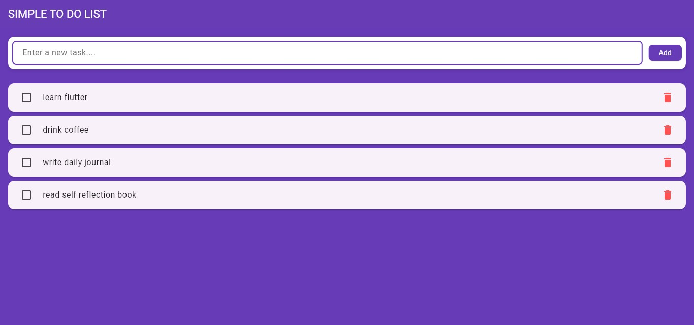
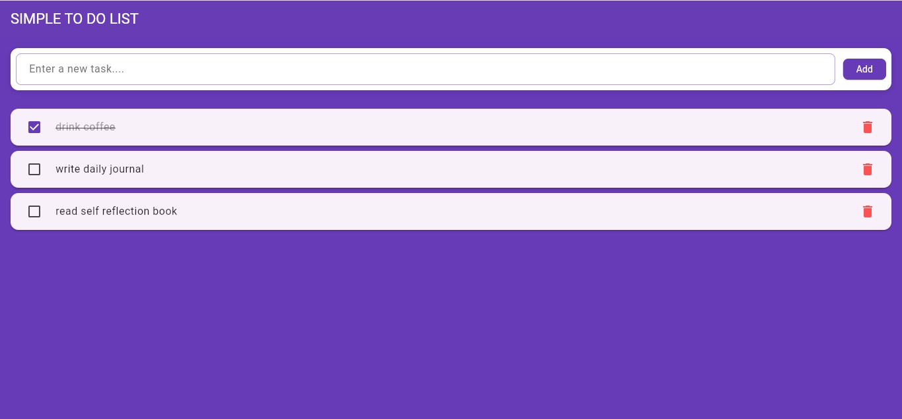

# Flutter To-Do List App

A clean and simple Flutter to-do list application that helps you stay organized. This app allows you to add tasks, mark them as complete, and delete them, with all data persisting locally on your device.

## Features

- **Splash Screen**: A professional entry screen on app startup.
- **Add Tasks**: Quickly add new items to your list.
- **Mark as Complete**: Toggle tasks as finished with a visual strike-through effect.
- **Delete Tasks**: Remove tasks you no longer need.
- **Persistent Storage**: Uses `SharedPreferences` to ensure your tasks are saved even after closing the app.
- **Modern UI**: Built with Material Design 3 and a deep purple theme.

## Screenshots

## Getting Started

### Prerequisites

- Flutter SDK: `^3.0.0`
- Dart SDK: `^3.0.0`

### Installation

1. **Clone the repository**:
   bash
   git clone 'https://github.com/ahmedshafifahad123/to_do_list_app_with_splascreen.git'
   
2**Run the app**:
   bash
   flutter run
   
## Dependencies

- `shared_preferences`: For local data persistence.
- `cupertino_icons`: For iOS-style icons.

## License

This project is open source.
